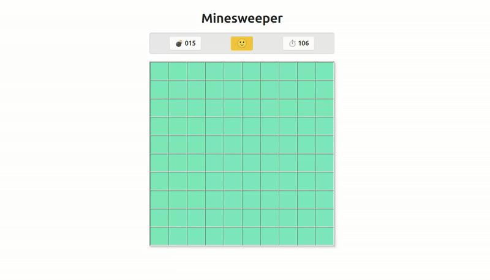

# minesweeper-game

A classic Minesweeper game built with ReactJS. This project recreates the popular puzzle game where players uncover tiles and avoid hidden mines. The application uses modern React features and JavaScript, providing an interactive and responsive user experience.



## How to Deploy Locally and Play

1. **Clone the repository:**
    ```bash
    git clone https://github.com/your-username/minesweeper-game.git
    cd minesweeper-game
    ```

2. **Install dependencies:**
    ```bash
    npm install
    ```

3. **Start the development server:**
    ```bash
    npm dev run
    ```

4. **Open the game in your browser:**
    - Visit [http://localhost:5173](http://localhost:5173) to play Minesweeper.

Enjoy the game!
